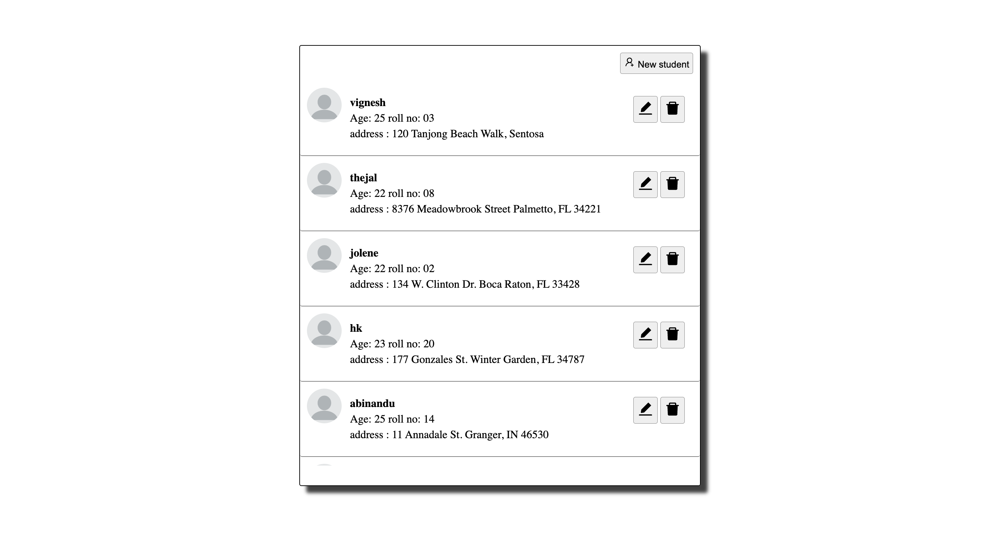
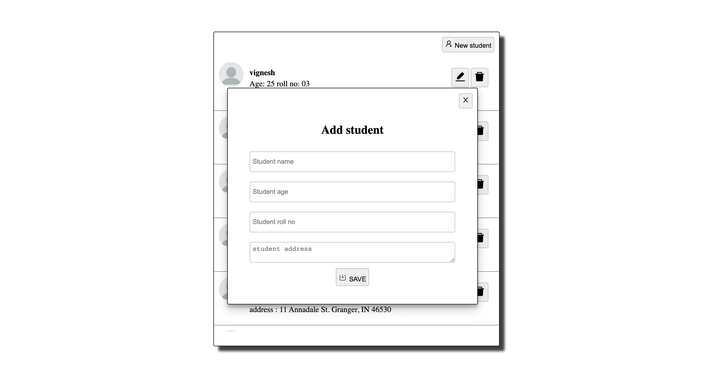
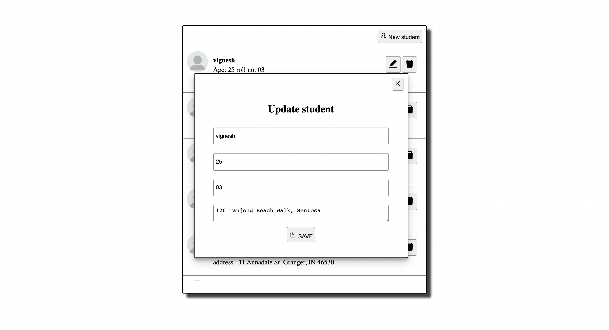

### CRUD

<div>
<a href="#overview">Overview</a> | <a href="#tech_stack">Tech stack</a> |  <a href="#preview">Preview</a> |  <a href="#setup">Setup</a>
</div>

## Overview

<div id="overview"></div>

A minimalistic app focussing on API and frontend logic to showcase my knowledge in node.

## TECH STACK

<div id="tech_stack"></div>
  
```
Node 
Next
Express
Mongoose
MongoDB
```

## Preview

<div id="preview"></div>

# Home page



# Add



# Update page



# Post page


## Setup

`/server/.env`

```
MONGODB_URI=<mongodb-uri>
SERVER_PORT=<desired-port-number>
```

# Start server

```
npm run serve

---
yarn serve

```

# Start client

```
npm run dev

---
yarn dev

```
